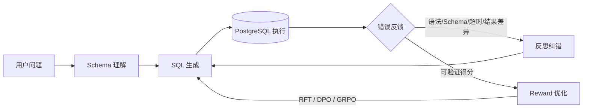

# Execution-Grounded Text-to-SQL Agent

一个面向金融多轮 Text-to-SQL 的可验证执行反馈系统：把数据库从“最终评分器”变成 Agent 的环境，利用真实执行结果完成标签治理、错误归因、反思纠错与后训练。

> **可核验成果：**构建 PostgreSQL 真执行反馈与反思纠错闭环，将候选/训练标签 SQL 的执行正确率从 **36.6%（2061/5635）提升至 97.32%（5484/5635）**。

这里特意写明“候选/训练标签 SQL”。97.32% 不是最终模型在独立测试集上的推理准确率；指标边界与复算方式见 [docs/metrics.md](docs/metrics.md)。

## 核心链路



这条链路对应工程上的两个环：

1. **在线反思环**：生成 SQL → 安全执行 → 返回结构化错误 → 模型重写；
2. **离线学习环**：批量 rollout → 真库执行打分 → verified-only SFT / DPO 偏好对 / GRPO 在线更新。

## 我做了什么

- 建立 PostgreSQL 沙箱执行环境：只读事务、单语句限制、超时、固定 `Asia/Shanghai` 时区；
- 用“列序一致 + 行多重集合一致”定义 execution match，保留重复行并规避浮点比较噪声；
- 对 5,635 个多轮样本做全量错误归因，将问题拆成 Schema grounding、投影列、过滤/聚合、执行错误四大类；
- 设计分层修复：确定性规则处理枚举/城市/日期/谓词，复杂 JOIN、子查询、窗口函数交给模型生成候选，**每次修复必须回到真库复验**；
- 把同一个执行验证器复用为稠密 reward、反思反馈与 DPO/GRPO 数据接口，避免训练、评测口径漂移；
- 形成后训练路线：verified-only SFT 冷启动 → RFT → GRPO 主优化 → DPO 定向收尾；PPO 作为带 critic 的对照方案。

## 结果与关键洞察

| 阶段 | 正确数 | 执行正确率 | 作用 |
|---|---:|---:|---|
| 基础模型候选 | 2061 / 5635 | 36.57% | 初始基线 |
| 强模型伪标签 | 4901 / 5635 | 86.97% | 提供更好的候选起点 |
| 固定评测时区 `+08` | 5246 / 5635 | 93.10% | 消除 345 条伪错误 |
| 规则/模型修复后复验 | 5484 / 5635 | **97.32%** | verified-only 正确集 |

最大单项提升不是换模型，而是修正执行环境的时区。月度 `date_trunc` 在 UTC 与东八区的边界不同；若 gold 和候选不在同一会话语义下执行，Reward 会把正确 SQL 判错，随后 RL 会稳定地学向错误目标。

## 代码导航

| 路径 | 内容 |
|---|---|
| `src/text2sql_feedback/executor.py` | PostgreSQL 只读、超时、时区固定执行边界 |
| `src/text2sql_feedback/evaluation.py` | 有序结果/无序多重集合比对 |
| `src/text2sql_feedback/reward.py` | exact match 锚定的稠密执行奖励 |
| `src/text2sql_feedback/loop.py` | 生成—执行—反馈—重写的反思闭环 |
| `src/text2sql_feedback/schema.py` | Schema 与外键关系抽取 |
| `src/text2sql_feedback/post_training.py` | DPO、GRPO、PPO 核心目标函数与偏好对构造 |
| `scripts/train_grpo.py` | PostgreSQL reward 接入 TRL GRPO 的训练入口 |
| `scripts/train_dpo.py` | execution-derived 偏好对的 DPO 入口 |
| `scripts/ppo_objective_demo.py` | PPO policy/value clipped update 教学内核（非成果冒充） |
| `scripts/serve_vllm.sh` | vLLM serving/前缀缓存的可调基线 |
| `framework/` | Twinkle 框架 fork、Qwen3.5 LoRA/NPU 项目适配与归属说明 |
| `docs/twinkle-framework-interview.md` | Twinkle 架构、分布式、GRPO/DPO/PPO、vLLM 权重同步的源码级面试讲义 |

## 面试阅读顺序

1. 先用 [docs/interview-guide.md](docs/interview-guide.md) 背熟项目的 30 秒和 2 分钟主线；
2. 再沿 [docs/twinkle-framework-interview.md](docs/twinkle-framework-interview.md) 讲清 Twinkle 的数据层、执行层、分布式拓扑与 RL 训练循环；
3. 最后用 [docs/post-training-and-inference.md](docs/post-training-and-inference.md) 补齐 PPO/DPO/GRPO 公式、vLLM、PagedAttention 和 KV Cache 工程细节。

面试表达边界：可以说“基于 Twinkle 适配 verified-only Text-to-SQL LoRA/SFT，并把 PostgreSQL verifier 设计成可迁移到 GRPO/DPO 的 reward 接口”；不要把 Twinkle 上游源码说成个人原创，也不要把 97.32% 说成 GRPO 后的模型测试集准确率。

## 快速运行

纯逻辑测试不需要数据库或模型：

```bash
python -m venv .venv
source .venv/bin/activate
pip install -e ".[dev]"
pytest
```

验证 PostgreSQL execution reward：

```bash
docker compose up -d --wait
pip install -e ".[postgres]"
python examples/postgres_reward_demo.py
```

预期 `RewardBreakdown(total=1.0, ..., exact_match=True)`。演示库完全合成，不包含赛题原始数据。

## 后训练怎么选

| 方法 | 信号 | 是否在线采样 | 额外 value/critic | 在本项目中的定位 |
|---|---|---:|---:|---|
| RFT | 执行通过的正样本 | 是，训练前批量做 | 否 | 最稳的第一步，清除明显不可执行输出 |
| DPO | chosen / rejected SQL 对 | 否 | 否 | 针对反复出现的顽固错误做离线收尾 |
| GRPO | 同一问题一组 SQL 的相对 reward | 是 | 否 | 主方案；结果可验证且显存预算受限 |
| PPO | reward + GAE/return | 是 | **是** | 通用但系统更重，作为理解 RLHF 的对照 |

更完整的目标函数、训练时序、vLLM、PagedAttention 与 KV Cache 工程细节见 [docs/post-training-and-inference.md](docs/post-training-and-inference.md)；Twinkle 的对象关系、源码调用链和面试追问见 [docs/twinkle-framework-interview.md](docs/twinkle-framework-interview.md)。

## 简历写法

推荐用这一句，既突出结果，也守住指标边界：

> **构建 PostgreSQL 真执行环境作为 Text-to-SQL Agent 反馈闭环，设计 Schema grounding、错误归因与反思纠错 pipeline，将候选/训练标签 SQL 执行正确率由 36.6% 提升至 97.32%（5484/5635）。**

面试时再补一句：“执行结果是可验证奖励，同一 verifier 同时服务数据清洗、Agent retry 和 GRPO/DPO 后训练。”详细讲法见 [docs/interview-guide.md](docs/interview-guide.md)。

## 公开范围

本仓库只公开本人整理后的通用实现、合成 demo、聚合指标和技术复盘。原始题目、数据库 dump、账号/Cookie/Token、模型权重、内部连接方式及第三方框架源码均未上传。
