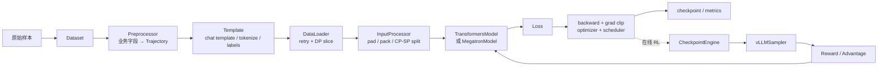
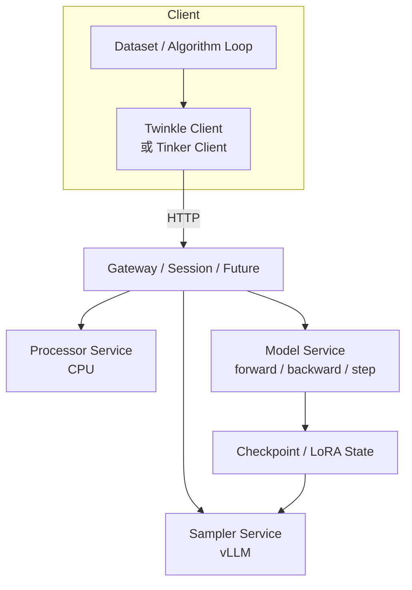
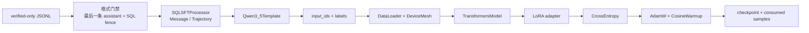
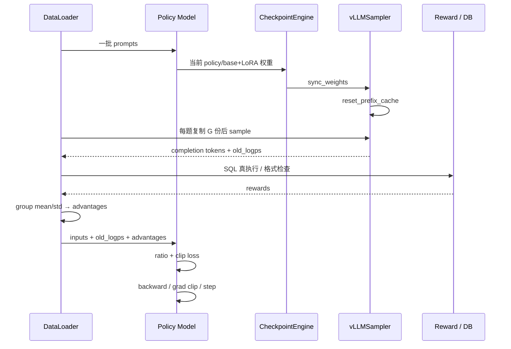
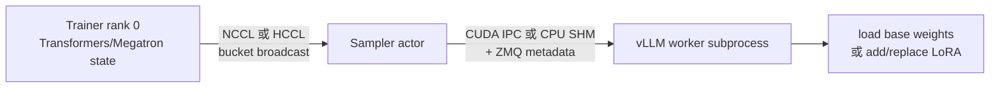
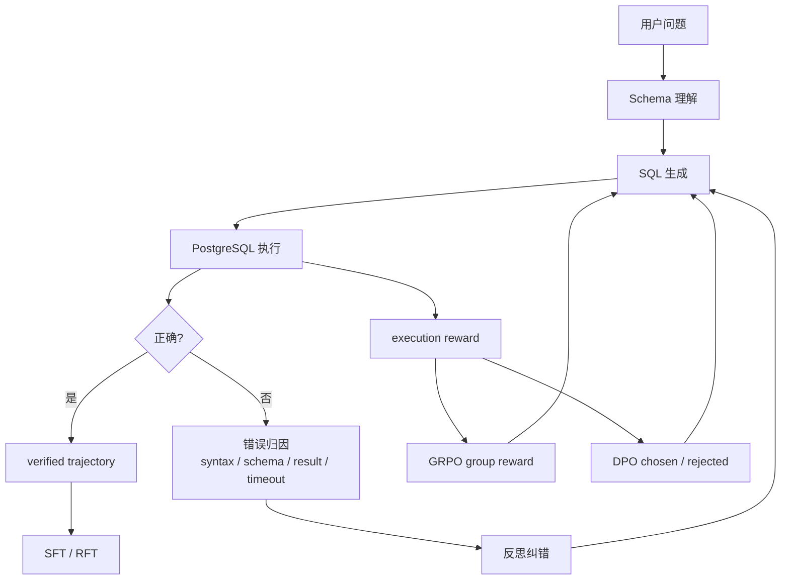

# Twinkle 框架源码级面试讲义

> 目标：不是背 API，而是能从一次 `forward_backward` 讲到数据分片、loss、rollout、权重同步和 NPU 通信，并始终守住“上游能力 / 本项目适配 / 已验证结果”的证据边界。
>
> 研究快照：本文按 ModelScope Twinkle 主仓库提交 [`1040a02`](https://github.com/modelscope/twinkle/commit/1040a02d08c390031800093336718589160b52af) 校对，日期为 2026-09-04。源码链接固定到该提交，避免 `main` 后续变化导致讲义与实现不一致。

## 0. 先记住这张“证据边界表”

| 层级 | 可以怎么说 | 不能怎么说 |
|---|---|---|
| Twinkle 上游框架能力 | Twinkle 提供 Dataset、Template、Model、Loss、Sampler、Ray/HTTP、Transformers/Megatron，以及 SFT、DPO、GRPO、PPO 的组件和 cookbook | “我独立开发了 Twinkle 框架” |
| 本项目已经完成 | 我实现了 Text-to-SQL 数据契约、SQL 格式门禁、verified-only 数据入口、Qwen3.5 LoRA/SFT 的 Twinkle + Ascend NPU 适配脚本；实现了 PostgreSQL 真执行 verifier 和可迁移到 DPO/GRPO 的 reward 接口 | “已经在 NPU 上完成了完整 GRPO/PPO 训练” |
| 本项目已有量化证据 | 候选/训练标签 SQL 的真库执行命中率由 36.6% 提升到 97.32% | “GRPO 把模型测试准确率从 36.6% 提升到 97.32%” |
| 已补齐但尚未声称产出 | DPO/GRPO/PPO 的目标函数、参考实现、Twinkle 源码调用链、vLLM 权重同步和排障路线 | “这些算法都已经在线上训练并产出指标” |

最稳妥的个人表述：

> 我基于 Twinkle 适配了 verified-only Text-to-SQL LoRA/SFT 数据与训练入口，并把 PostgreSQL verifier 设计成可复用于数据清洗、Agent 反思和后续 DPO/GRPO 的奖励接口。Twinkle 的分布式运行时、loss 和 vLLM sampler 是上游能力；我没有把上游源码冒充成个人原创，也没有把 97.32% 解释为 GRPO 后的模型泛化指标。

项目证据见 [`metrics.md`](metrics.md)、[`../framework/twinkle_sft_qwen35_npu.py`](../framework/twinkle_sft_qwen35_npu.py) 和 [`../framework/NOTICE.md`](../framework/NOTICE.md)；Twinkle 的框架定位见其[官方 README](https://github.com/modelscope/twinkle/blob/1040a02d08c390031800093336718589160b52af/README_ZH.md)。

---

## 1. 一句话心智模型

Twinkle 可以理解成五层：

1. **数据语义层**：`Dataset + Preprocessor + Template` 把业务样本变成带 loss mask 的 `InputFeature`；
2. **批处理层**：`DataLoader + InputProcessor` 负责重试、按数据并行 rank 分片、padding/packing、搬到设备；
3. **训练抽象层**：`TwinkleModel + Loss + OptimizerGroup` 统一前向、反向、梯度累积、指标和 checkpoint；
4. **分布式运行层**：`DeviceGroup + DeviceMesh + remote_class/remote_function` 决定组件放在哪些设备上、输入怎么分发、输出怎么收集；
5. **在线后训练层**：`Sampler + Reward + Advantage + CheckpointEngine` 把 rollout、环境奖励和 policy 更新闭成环。

源码依据：[`Dataset`](https://github.com/modelscope/twinkle/blob/1040a02d08c390031800093336718589160b52af/src/twinkle/dataset/base.py)、[`Template`](https://github.com/modelscope/twinkle/blob/1040a02d08c390031800093336718589160b52af/src/twinkle/template/base.py)、[`DataLoader`](https://github.com/modelscope/twinkle/blob/1040a02d08c390031800093336718589160b52af/src/twinkle/dataloader/dataloader.py)、[`InputProcessor`](https://github.com/modelscope/twinkle/blob/1040a02d08c390031800093336718589160b52af/src/twinkle/processor/base.py)、[`TwinkleModel`](https://github.com/modelscope/twinkle/blob/1040a02d08c390031800093336718589160b52af/src/twinkle/model/base.py)。

---

## 2. local、Ray、HTTP：三种使用形态不是同一个枚举

这是很容易被追问的细节。

### 2.1 `local`：单进程或 torchrun

`twinkle.initialize(mode="local")` 不替你拉起多个进程。单卡直接 `python`，多卡由 `torchrun` 预先创建进程；Twinkle 读取 `RANK/WORLD_SIZE/LOCAL_RANK`，用 `DeviceMesh` 建进程组并在当前进程内执行组件。

适合：

- 单机 SFT、调试和最小复现；
- 训练组件不需要跨独立资源池；
- 希望用 torchrun/HCCL 或 NCCL 管理进程生命周期。

### 2.2 `ray`：Driver 编排，Actor 承载组件

`twinkle.initialize(mode="ray", groups=...)` 让带 `@remote_class` 的 Dataset、DataLoader、Model、Sampler 等按 `remote_group` 构造成 Ray actor。`@remote_function` 再声明：

- `dispatch`：输入是广播、按 worker 切片，还是按 DP 维切片；
- `execute`：首个 worker、全部 worker或 peer；
- `collect`：`first/flatten/mean/sum/last_pp` 等；
- `lazy_collect`：是否把 Ray future 延迟到下游 worker 解引用，减少 Driver 往返。

在线 RL 常把 `policy`、`critic`、`sampler` 放进不同 `DeviceGroup`，因此 Ray 形态最自然。

### 2.3 `HTTP`：Client/Server 服务形态

HTTP 不是 `twinkle.initialize("http")`。核心 `initialize` 的合法值只有 `local` 和 `ray`；HTTP 路径由 Twinkle Client/Tinker Client 调用 Ray Serve 上的 Gateway、Model、Sampler、Processor 服务。

Server 负责：

- 基座模型与 LoRA 生命周期；
- forward/backward、optimizer step、sampling、checkpoint；
- session、future、限流、持久化和可观测性。

Client 负责：

- 数据准备与算法训练循环；
- 超参和每步调用编排；
- 通过 HTTP 获取异步 future 结果。

这就是“训练逻辑与模型承载解耦”。同一基座可以承载多个 LoRA，形成多租户训练服务。

源码依据：[`initialize` 与远程装饰器](https://github.com/modelscope/twinkle/blob/1040a02d08c390031800093336718589160b52af/src/twinkle/infra/__init__.py)、[RemoteClass 官方说明](https://github.com/modelscope/twinkle/blob/1040a02d08c390031800093336718589160b52af/docs/source_en/Components/Training%20Middleware/RemoteClass.md)、[Client/Server 概览](https://github.com/modelscope/twinkle/blob/1040a02d08c390031800093336718589160b52af/docs/source_en/Usage%20Guide/Server%20and%20Client/Overview.md)、[Server 配置](https://github.com/modelscope/twinkle/blob/1040a02d08c390031800093336718589160b52af/docs/source_en/Usage%20Guide/Server%20and%20Client/Server.md)。

---

## 3. 数据怎样走完一次训练

### 3.1 Dataset：加载、清洗、编码

`DatasetMeta` 可指向本地文件、ModelScope/Hugging Face 数据集，也可以直接接收内存中的 list、dict、generator 或已有 HF Dataset。`Dataset` 的典型顺序是：

~~~python
dataset = Dataset(DatasetMeta(DATASET_ID))
dataset.filter(...)
dataset.set_template(...)
dataset.map(MyPreprocessor)
dataset.encode()
~~~

职责要分清：

- **Preprocessor** 理解业务 schema，把原始字段变成统一 `Trajectory(messages=...)`；
- **Template** 理解模型协议，把消息转为 `input_ids/labels/attention_mask`；
- **Dataset** 负责调用 map/filter/encode 和缓存，不应塞进训练算法。

在 SFT 中，Template 只把 assistant token 放进 labels；system/user/tool token 的 label 是 `-100`，因此不参与语言模型损失。推理/rollout 使用 `add_generation_prompt=True`，只编码 prompt，不给 prompt token 训练标签。

### 3.2 DataLoader：可靠取数与 DP 分片

Twinkle 的 DataLoader 是 PyTorch DataLoader 包装层：

- 用 `RetrySampler` 重试失败样本；
- 用 `DeviceMeshSampler` 按 data rank 分片；
- 要求全局 `batch_size >= data_world_size` 且能整除；
- 自动记录 `consumed_train_samples`，用于 checkpoint 后跳过已消费数据；
- Ray 下推荐传 Dataset factory，让 Dataset 和 DataLoader 在同一 worker 构造，减少序列化。

### 3.3 InputProcessor：模型前最后一道形状契约

InputProcessor 的默认流水线包括：

1. list/numpy → tensor，并搬到本地设备；
2. 为 CP 对齐序列长度；
3. 对齐 MoE routed experts；
4. padding 或 padding-free 拼接；
5. 只保留 Transformers/Megatron 需要的字段；
6. 增加 packing 元数据；
7. 按 CP/SP 切分；
8. forward 后把 SP/packed 输出重新对齐到 loss 所需形状。

普通 padding 的核心是：

- `input_ids` 补 0；
- `attention_mask` 补 0；
- `labels` 补 `-100`；
- 最终 loss 只统计 `labels != -100` 的 token。

padding-free 会把多个序列拼为一条长序列，并使用 `position_ids/cu_seqlens` 保留边界，减少 pad token 浪费；这要求 attention 内核明确支持 packed sequence。

### 3.4 Model：forward → loss → backward → step

以 `TransformersModel.forward_backward` 为例：

1. `forward` 检查输入；若还是 `Trajectory`，先用 model 绑定的 Template 编码；
2. InputProcessor 做 batch/设备/并行处理；
3. Hugging Face model forward；
4. 根据 loss 的需要计算 selective token logprob、entropy 或 value；
5. `calculate_loss` 调用当前 adapter 的 loss；
6. `backward` 处理混合精度与梯度累积；
7. `clip_grad_and_step` 依次做 grad norm、optimizer step、zero grad、scheduler step。

`OptimizerGroup` 把某个 adapter 的 loss、optimizer、scheduler、metric、template、processor、梯度累积步数放在一起。这是多 LoRA/多租户时避免状态串线的关键。

源码依据：[`Dataset.encode`](https://github.com/modelscope/twinkle/blob/1040a02d08c390031800093336718589160b52af/src/twinkle/dataset/base.py)、[`Template._encode_messages`](https://github.com/modelscope/twinkle/blob/1040a02d08c390031800093336718589160b52af/src/twinkle/template/base.py)、[`DataLoader`](https://github.com/modelscope/twinkle/blob/1040a02d08c390031800093336718589160b52af/src/twinkle/dataloader/dataloader.py)、[`InputProcessor`](https://github.com/modelscope/twinkle/blob/1040a02d08c390031800093336718589160b52af/src/twinkle/processor/base.py)、[`TransformersModel.forward_backward`](https://github.com/modelscope/twinkle/blob/1040a02d08c390031800093336718589160b52af/src/twinkle/model/transformers/transformers.py)。

---

## 4. DeviceGroup 与 DeviceMesh：一个管“卡归谁”，一个管“卡怎么协作”

### 4.1 DeviceGroup

`DeviceGroup(name, ranks, device_type, gpus_per_worker, visible_devices)` 表示资源所有权。

例如 RL 拆成：

- `policy`：训练策略模型；
- `critic`：PPO value model；
- `sampler`：vLLM rollout。

资源分离的收益是训练和推理的显存、kernel、batch 节奏互不干扰；代价是每次 policy 更新后必须同步权重。

### 4.2 DeviceMesh

`DeviceMesh` 表示组内逻辑拓扑，决定数据切片、进程组和模型并行策略。常见维度：

| 维度 | 切什么 | 通信/代价 | 典型用途 |
|---|---|---|---|
| DP | 样本 | 梯度 all-reduce | 模型单卡放得下，扩大吞吐 |
| FSDP | 参数、梯度、优化器状态 | 参数 all-gather / reduce-scatter | 大模型省单卡显存 |
| TP | 单层张量/矩阵 | 层内 collective 频繁 | 单层放不下 |
| PP | 网络层 | stage 间 activation 通信，有 pipeline bubble | 模型深度方向分片 |
| CP | 上下文序列 | attention 上下文通信 | 超长上下文 |
| EP | MoE experts | token all-to-all | 多专家模型 |
| SP/Ulysses | 序列 | attention 前后 all-to-all | Transformers 长序列 |
| Megatron sequence parallel | TP 区域中的 activation | reduce-scatter/all-gather | 降 activation 显存 |

一个 8 卡示例：

~~~python
mesh = DeviceMesh.from_sizes(
    world_size=8,
    dp_size=2,
    tp_size=2,
    pp_size=2,
)
~~~

逻辑上是 `2 × 2 × 2 = 8`。对同一 DP replica，TP rank 共同算一层，PP stage 共同算完整网络；DataLoader 只按数据维切 batch，不能把同一个 TP/PP 组成员当作独立样本消费者。

### 4.3 `dispatch="slice_dp"` 为什么重要

`remote_function(dispatch="slice_dp")` 根据 `DeviceMesh` 的 data rank 切 batch：

- 同一个 TP/PP/CP 组内，需要拿到相同的样本切片；
- 不同 DP replica 才拿不同样本；
- 输出收集时通常只取每个 data rank 的代表，PP 则优先取最后 stage。

若直接按 worker 数平均切，TP rank 会拿到不同样本，collective 的形状和语义都会错。

源码依据：[`DeviceMesh/DeviceGroup`](https://github.com/modelscope/twinkle/blob/1040a02d08c390031800093336718589160b52af/src/twinkle/utils/device_mesh.py)、[官方拓扑说明](https://github.com/modelscope/twinkle/blob/1040a02d08c390031800093336718589160b52af/docs/source_en/Components/Training%20Middleware/DeviceMesh-and-DeviceGroup.md)、[`slice_dp` 分发实现](https://github.com/modelscope/twinkle/blob/1040a02d08c390031800093336718589160b52af/src/twinkle/infra/__init__.py)。

---

## 5. Transformers 与 Megatron 后端如何选择

### TransformersModel

特点：

- 复用 Hugging Face 模型和 PEFT；
- 支持 DDP/FSDP2、Transformers 侧 Ulysses SP 和 MoE EP；
- `accelerate` 或 `native_fsdp` strategy；
- 改模型、加 LoRA、快速实验成本低。

适合本项目的原因：Qwen3.5 2B + LoRA，重点是验证数据闭环和 NPU 适配，优先减少框架改造量。

### MegatronModel

特点：

- 面向大模型的 TP/PP/CP/EP 和 Megatron sequence parallel；
- 数据、optimizer、scheduler、pipeline schedule 都遵循 Megatron 体系；
- Twinkle 文档明确要求使用 MegatronDistributedOptimizer 与其调度器；
- 超大 dense/MoE 模型更合适，但配置和排障复杂度更高。

### 面试选型回答

> 模型较小且要快速做 LoRA/业务 loss 时，我先用 Transformers/FSDP；单层或整体已经放不下，或者需要 TP/PP/CP/EP 的成熟组合时才切 Megatron。二者上层仍用同一套 Dataset、Loss、Sampler 和训练循环接口，因此算法层与并行后端解耦。

注意：不要说“FSDP 就是 TP”。FSDP 在计算某层前临时聚合该层参数，TP 则让多个 rank 共同执行同一层的矩阵计算，通信位置和模型语义不同。

源码依据：[TransformersModel 文档](https://github.com/modelscope/twinkle/blob/1040a02d08c390031800093336718589160b52af/docs/source_en/Components/Model/TransformersModel.md)、[MegatronModel 文档](https://github.com/modelscope/twinkle/blob/1040a02d08c390031800093336718589160b52af/docs/source_en/Components/Model/MegatronModel.md)、[Transformers strategy](https://github.com/modelscope/twinkle/tree/1040a02d08c390031800093336718589160b52af/src/twinkle/model/transformers/strategy)、[Megatron strategy](https://github.com/modelscope/twinkle/tree/1040a02d08c390031800093336718589160b52af/src/twinkle/model/megatron/strategy)。

---

## 6. SFT：本项目实际适配的训练路径

### 6.1 原理

对 assistant 输出 token 做 teacher forcing：

$$
\mathcal L_{\text{SFT}}
=-\frac{1}{|M|}\sum_t M_t\log \pi_\theta(y_t\mid x,y_{<t}),
$$

其中 `M_t = 1` 只对应 assistant/SQL token，prompt 和 padding 的 label 为 `-100`。

### 6.2 本项目调用链

项目适配中的关键工程点：

- 训练前逐行解析 JSONL，任一记录不符合数据契约就 fail fast；
- 只接受最后一轮为 assistant 且答案有 SQL code fence 的记录；
- Qwen3.5 Template 关闭 thinking，保证输出协议稳定；
- `use_cache=False`：训练时不复用自回归 KV cache，避免无用显存和与梯度路径冲突；
- `kernelize(model)` 让 Twinkle 按平台替换可用内核；
- LoRA 只让低秩参数参与优化，降低 NPU 显存与 checkpoint 体积；
- checkpoint 同时保存 optimizer、scheduler、RNG/训练进度和 DataLoader 已消费样本，续训才是语义完整的。

代码依据：[`twinkle_sft_qwen35_npu.py`](../framework/twinkle_sft_qwen35_npu.py)、[`CrossEntropyLoss`](https://github.com/modelscope/twinkle/blob/1040a02d08c390031800093336718589160b52af/src/twinkle/loss/cross_entropy.py)、[`TransformersModel.save/resume`](https://github.com/modelscope/twinkle/blob/1040a02d08c390031800093336718589160b52af/src/twinkle/model/transformers/transformers.py)。

---

## 7. DPO：离线偏好对怎样进入 Twinkle

### 7.1 原理

对同一 prompt 的 chosen/rejected：

$$
\mathcal L_{\text{DPO}}
=-\log\sigma\left(
\beta[
\log\pi_\theta(y_w|x)-\log\pi_{\text{ref}}(y_w|x)
-\log\pi_\theta(y_l|x)+\log\pi_{\text{ref}}(y_l|x)
]\right).
$$

它直接提高 chosen 相对 rejected 的 policy/reference log-ratio，不需要显式训练 reward model，也不在训练中在线访问数据库。原理来源：[DPO 原论文](https://arxiv.org/abs/2305.18290)。

### 7.2 Twinkle 实现

1. Preprocessor 生成 `positive/negative` 两条 Trajectory；
2. cookbook 把 batch 交错成 `[pos1, neg1, pos2, neg2, ...]`；
3. 同一个 LoRA 模型先 `forward_only(disable_lora=True)`，用冻结基座得到 reference logps；
4. 再启用 LoRA 做 policy forward/backward；
5. `DPOLoss` 对有效 token logprob 求和成序列 logprob，再计算 margin 和 `-logsigmoid`；
6. 可选 `sft_weight` 在 chosen 上叠加 NLL，缓解 chosen likelihood displacement。

为什么必须交错？因为 `slice_dp` 后每个 DP rank 仍需拿到完整 `(chosen,rejected)` 对。若把所有 chosen 放前半、rejected 放后半，DP 切片可能让某个 rank 只拿到一类样本。

源码细节：`DPOLoss._split_chosen_rejected` 实际按偶数/奇数索引拆分；面试应以实现为准，不要被文件中残留的“first half / second half”旧注释带偏。

源码依据：[`dpo_lora.py`](https://github.com/modelscope/twinkle/blob/1040a02d08c390031800093336718589160b52af/cookbook/rl/dpo/dpo_lora.py)、[`DPO Preprocessor`](https://github.com/modelscope/twinkle/blob/1040a02d08c390031800093336718589160b52af/src/twinkle/preprocessor/dpo.py)、[`DPOLoss`](https://github.com/modelscope/twinkle/blob/1040a02d08c390031800093336718589160b52af/src/twinkle/loss/dpo.py)。

### 7.3 Text-to-SQL 怎么造偏好对

同一问题采样多条 SQL 后按执行证据排序：

1. 结果等价且格式合规；
2. 可执行但结果错误；
3. schema/语法错误；
4. 超时或危险语句。

最高可信候选做 chosen，最低可信候选做 rejected。必须保留同一个 schema snapshot、数据库版本和会话上下文，否则 pair 不是只比较 SQL 质量。

---

## 8. GRPO：最应该讲透的一条循环

### 8.1 原理

对同一 prompt 采样 $G$ 个 completion，Twinkle 的 `GRPOAdvantage` 先做：

$$
A_i = \frac{r_i-\operatorname{mean}(r_{1:G})}
{\operatorname{std}(r_{1:G})+\epsilon}.
$$

policy loss 使用 old/new token 概率比：

$$
\rho_{i,t}=\exp(\log\pi_\theta(y_{i,t})-\log\pi_{\text{old}}(y_{i,t})),
$$

$$
\mathcal L_{\text{policy}}
=-\operatorname{mean}_{i,t}
\min(\rho_{i,t}A_i,\operatorname{clip}(\rho_{i,t},1-\epsilon,1+\epsilon_h)A_i).
$$

通用 `GRPOLoss` 还支持 reference KL 和 entropy bonus。GRPO 用同 prompt 组内 reward 当 baseline，省掉 PPO critic；核心来源：[DeepSeekMath](https://arxiv.org/abs/2402.03300)。

### 8.2 Twinkle 当前 cookbook 的逐行逻辑

对应实现：

1. `model` 与 `sampler` 分配独立 DeviceGroup；
2. `CheckpointEngineManager.sync_weights(merge_and_sync=False)`：
   - 首次同步 base；
   - 后续只传 LoRA；
3. `sampler.reset_prefix_cache()` 清理旧权重产生的 prefix cache；
4. prompt 复制 `NUM_GENERATIONS` 次；
5. vLLM 返回 completion token、response-only old logps 和拼好的 `new_input_feature`；
6. reward 函数对轨迹打分；
7. `GRPOAdvantage(..., scale="group")` 做组内中心化/标准化；
8. completion 按 mini-batch 送入 `model.forward_backward`；
9. `GRPOLoss` 用 labels mask 把 response-only old logps 精确散射到 completion token 位置；
10. 梯度裁剪、optimizer step、metric 与 checkpoint。

### 8.3 两个必须讲清的实现边界

第一，**old policy 不等于 reference policy**：

- old policy 是生成当前 rollout 的行为策略，进入 importance ratio；
- reference policy 是稳定锚点，只在启用 KL 时使用；
- 二者可能初始相同，但职责不同。

第二，**当前通用 Loss 能力不等于 cookbook 默认配置**：

- `GRPOLoss` 支持 `beta > 0` 和 `ref_logps`；
- 当前 `cookbook/rl/grpo/grpo.py` 只设置 `epsilon=0.2`，没有计算 `ref_logps`，因此默认 `beta=0`，实际跑的是 clipped group-relative policy loss，不含 reference KL。

这是阅读源码后应主动说明的事实。

源码依据：[`GRPO cookbook`](https://github.com/modelscope/twinkle/blob/1040a02d08c390031800093336718589160b52af/cookbook/rl/grpo/grpo.py)、[`GRPOAdvantage`](https://github.com/modelscope/twinkle/blob/1040a02d08c390031800093336718589160b52af/src/twinkle/advantage/grpo.py)、[`GRPOLoss`](https://github.com/modelscope/twinkle/blob/1040a02d08c390031800093336718589160b52af/src/twinkle/loss/grpo.py)、[`GRPOMetric`](https://github.com/modelscope/twinkle/blob/1040a02d08c390031800093336718589160b52af/src/twinkle/metric/grpo.py)。

### 8.4 Text-to-SQL reward 设计

建议分层，但不要让可投机代理信号压过最终结果：

$$
r =
w_e r_{\text{execution}}
+w_r r_{\text{result}}
+w_f r_{\text{format}}
+w_s r_{\text{schema}}
-w_t r_{\text{timeout}}
-w_u r_{\text{unsafe}}.
$$

优先级：

1. 安全与只读门禁；
2. SQL 可执行；
3. 结果集等价；
4. 格式/schema shaping。

同组全对或全错时，标准差接近 0，advantage 全为 0 或近 0。加 epsilon 只能防 NaN，不能制造学习信号。真正的修复是课程采样、增加合理的 $G$、调整温度，或让题目落在当前策略“有时会、有时不会”的难度区间。

---

## 9. PPO：为什么系统明显更重

### 9.1 原理

PPO 的 policy clipped objective 与 GRPO 形式相近，但 advantage 来自 critic：

$$
\delta_t=r_t+\gamma V(s_{t+1})-V(s_t),
$$

$$
A_t=\delta_t+\gamma\lambda A_{t+1},
\qquad R_t=A_t+V(s_t).
$$

critic 还要做 clipped value loss。原理来源：[PPO 原论文](https://arxiv.org/abs/1707.06347)。

### 9.2 Twinkle 实现

当前 PPO cookbook 分三个资源组：

- policy：LoRA 策略模型；
- critic：全参数 `TransformersValueModel`；
- sampler：vLLM。

每个 rollout：

1. policy → sampler 同步权重并清 prefix cache；
2. vLLM 采样并返回 old logps；
3. 冻结 policy base（`disable_lora=True`）给 reference logps；
4. critic 给 old values；
5. `build_token_rewards` 把序列 reward 放在终止 token，并可逐 token 加 `-kl_coef(old_logp-ref_logp)`；
6. `GAEAdvantage` 反向扫描得到 advantage/return；
7. 同一 rollout 做多轮 shuffled mini-batch；
8. policy 用 `PPOLoss`，critic 用 `PPOValueLoss`，分别更新。

Twinkle 的 `PPOLoss` 复用 `GRPOLoss` 的 ratio/clip 实现，只改变聚合模式；算法的主要区别不在 clip 公式，而在 advantage 的来源和 critic/value update。

源码依据：[`PPO cookbook`](https://github.com/modelscope/twinkle/blob/1040a02d08c390031800093336718589160b52af/cookbook/rl/ppo/ppo.py)、[`GAEAdvantage`](https://github.com/modelscope/twinkle/blob/1040a02d08c390031800093336718589160b52af/src/twinkle/advantage/gae.py)、[`PPOLoss`](https://github.com/modelscope/twinkle/blob/1040a02d08c390031800093336718589160b52af/src/twinkle/loss/grpo.py)、[`PPOValueLoss`](https://github.com/modelscope/twinkle/blob/1040a02d08c390031800093336718589160b52af/src/twinkle/loss/value.py)。

### 9.3 为什么本项目优先 GRPO

Text-to-SQL 有便宜、客观的终局执行 reward，同一问题天然可采样多个 SQL。GRPO 省掉 critic，更符合 2B 模型和有限 NPU 资源。若未来是多轮 Agent，需要判断“某一步修复把状态改善了多少”，step reward + critic 的 PPO 才更有价值。

---

## 10. vLLMSampler：rollout 不只是 `generate`

### 10.1 它做了什么

Twinkle 的 `vLLMSampler`：

- 用后台 event loop 承载 vLLM AsyncLLM，避免 Ray worker 已运行的 uvloop 冲突；
- 根据可见设备推断 tensor parallel size；
- 给不同 DP rank 设置不同随机种子；
- 复用与训练模型一致的 Template；
- 以 `dispatch="slice_dp"` 把 prompt 分给 rollout worker；
- 返回 completion tokens、logprobs、decoded text、stop reason 和可直接训练的 `new_input_feature`；
- 支持 LoRA path 加载、训练中内存 LoRA 权重刷新、sleep/wake 和 cache reset。

### 10.2 为什么 old logps 对齐容易出错

vLLM 返回的是 **response-only** logprob；训练模型的 logits/labels 通常覆盖 **prompt + response + padding**。Twinkle 的 `GRPOLoss._pad_and_align_to_batch` 根据 `labels != -100` 找 completion 位置，再散射 old logps：

- `len(old_logps[i]) == completion token 数`：按 response mask 散射；
- full-sequence logps：按 mask 截取；
- 其他长度：直接 assert，不静默截断。

静默 truncate 会把第 $t$ 个 old logp 对到错误 token，ratio 仍有数值但语义完全错，比显式报错更危险。

### 10.3 PagedAttention、KV cache 与 prefix cache

三个概念要区分：

- **KV cache**：每层为已处理 token 保存 K/V，decode 新 token 时无需重算整个前缀；
- **PagedAttention**：把 KV cache 切成固定 token 数的物理 block，通过 block table 映射逻辑序列，按需分配非连续显存，降低碎片和预留浪费；
- **automatic prefix caching**：对完整 prefix block 做 hash，使后续相同前缀请求复用已有 KV block，省掉重复 prefill。

vLLM 官方资料：[PagedAttention 设计](https://docs.vllm.ai/en/stable/design/paged_attention/)、[Automatic Prefix Caching](https://docs.vllm.ai/en/latest/design/prefix_caching/)。

### 10.4 policy 更新后为什么必须失效 cache

KV 是某个权重版本下计算出的中间状态：

$$
K_t=W_K^{(v)}h_t,\quad V_t=W_V^{(v)}h_t.
$$

policy 从版本 $v$ 更新到 $v+1$ 后，旧 KV 不再等价于新模型对同一 token 的计算。若 prefix cache 仍命中：

- rollout 文本由“新权重 + 旧前缀 KV”混合产生；
- vLLM 返回的 old logps 也不再严格对应声称的行为策略；
- RL 的 on-policy/importance-ratio 假设被破坏。

因此 Twinkle GRPO/PPO cookbook 在每次 `sync_weights` 后显式 `reset_prefix_cache`。同步时还应确保没有跨版本的 in-flight request；同步循环天然是“采样结束 → 更新 → 同步 → 再采样”，不要边更新边保留旧请求。

注意：清 prefix cache 不是把 vLLM 的整个 KV 内存永久释放；它主要让旧前缀映射不能继续复用。普通正在执行请求的 KV 生命周期仍由 scheduler 管理。

源码依据：[`vLLMSampler`](https://github.com/modelscope/twinkle/blob/1040a02d08c390031800093336718589160b52af/src/twinkle/sampler/vllm_sampler/vllm_sampler.py)、[`VLLMEngine`](https://github.com/modelscope/twinkle/blob/1040a02d08c390031800093336718589160b52af/src/twinkle/sampler/vllm_sampler/vllm_engine.py)、[`GRPO cookbook` 同步顺序](https://github.com/modelscope/twinkle/blob/1040a02d08c390031800093336718589160b52af/cookbook/rl/grpo/grpo.py)。

---

## 11. policy 权重如何进入 vLLM

训练与 rollout 分卡时，`CheckpointEngineManager` 做两段传输：

### 11.1 第一段：trainer → sampler actor

- GPU 选择 `NCCLCheckpointEngine`；
- NPU 选择 `HCCLCheckpointEngine`；
- 只有 trainer rank 0 是发送者，其他 trainer rank 不参加权重 payload broadcast；
- tensor 以 bucket 流式传输，避免在 sampler 侧同时物化一份完整模型；
- ZMQ 传 metadata，NCCL/HCCL 传 tensor payload。

### 11.2 第二段：sampler actor → vLLM subprocess

`VLLMEngine.update_weights` 继续把收到的权重逐个放入 bucket：

- CUDA tensor 走 CUDA IPC；
- 非 CUDA tensor（包括当前 NPU tensor 分支）走 CPU shared memory；
- vLLM worker extension 最终调用 base model `load_weights`，或把 PEFT 名称转换后用内存 `TensorLoRARequest` 加载 LoRA。

### 11.3 `merge_and_sync` 的取舍

`sync_weights(merge_and_sync=True)`：

- 每次把 LoRA merge 到 base 后同步完整权重；
- 兼容路径直观，但通信量大。

`sync_weights(merge_and_sync=False)`：

- 第一次同步 base；
- 后续只同步 LoRA tensor；
- vLLM 必须 `enable_lora=True`，且 `max_lora_rank` 不小于训练 rank；
- 同步后刷新缓存的 `LoRARequest`，采样请求才能自动使用最新 adapter。

NPU RL 适配时还有一个源码级细节：`CheckpointEngineManager` 的 `platform` 默认值是 `"GPU"`。若 model/sampler 真正在 Ascend NPU 上，构造 manager 时要明确 `platform="NPU"`，否则会错误选择 NCCL 后端。

源码依据：[`CheckpointEngineManager`](https://github.com/modelscope/twinkle/blob/1040a02d08c390031800093336718589160b52af/src/twinkle/checkpoint_engine/manager.py)、[`CheckpointEngineMixin`](https://github.com/modelscope/twinkle/blob/1040a02d08c390031800093336718589160b52af/src/twinkle/checkpoint_engine/mixin.py)、[`NCCLCheckpointEngine`](https://github.com/modelscope/twinkle/blob/1040a02d08c390031800093336718589160b52af/src/twinkle/checkpoint_engine/nccl_checkpoint_engine.py)、[`HCCLCheckpointEngine`](https://github.com/modelscope/twinkle/blob/1040a02d08c390031800093336718589160b52af/src/twinkle/checkpoint_engine/hccl_checkpoint_engine.py)、[`vLLM worker extension`](https://github.com/modelscope/twinkle/blob/1040a02d08c390031800093336718589160b52af/src/twinkle/sampler/vllm_sampler/vllm_worker_extension.py)。

---

## 12. Ascend NPU / HCCL 工程细节

### 12.1 环境层

按当前 Twinkle NPU 指引：

- Python 3.11；
- CANN 8.5.1 或更高；
- PyTorch 2.7.1 与 torch_npu 2.7.1 必须严格配套；
- vLLM 0.14.0 + vLLM-Ascend 0.14.0rc1 是文档给出的组合；
- Qwen3.5/3.6 的 FLA 依赖 `flash-linear-attention >= 0.5.2` 和匹配 CANN 的 triton-ascend；
- NPU 不支持当前 QLoRA 路径，项目使用 BF16 LoRA。

这些版本会随上游变化，真实运行必须固定镜像/lockfile，不能只写“最新版”。

### 12.2 通信层

Twinkle 的 NPU Platform：

- 可见卡环境变量为 `ASCEND_RT_VISIBLE_DEVICES`；
- device prefix 是 `npu`；
- distributed backend 是 `hccl`；
- model 初始化前根据 `MASTER_PORT` 派生 HCCL host/NPU socket port range，降低多任务默认端口冲突；
- checkpoint 同步用 HCCL payload + ZMQ metadata，并为 metadata 设置超时，避免永久挂死。

HCCL 权重引擎把 tensor 转成 uint8 bucket，支持大 tensor 分 chunk 广播；receiver 按 name、shape、dtype、offset 和 chunk offset 重组，再交给 vLLM。

### 12.3 本项目 SFT 路径

本项目入口是：

~~~bash
torchrun --nproc_per_node="${NUM_NPUS}" \
  framework/twinkle_sft_qwen35_npu.py
~~~

每个进程绑定一个 NPU，`DeviceMesh(fsdp, dp, device_type="npu")` 表达拓扑。需检查：

- `FSDP_SIZE * DP_SIZE == NUM_NPUS`；
- `BATCH_SIZE >= NUM_NPUS`，并能被 data world size 整除；
- 所有 rank 看到相同模型、数据和输出路径；
- `MASTER_ADDR/MASTER_PORT` 唯一且节点间可达；
- CANN 环境脚本已加载；
- checkpoint 目录可被目标 rank 正确访问。

### 12.4 数值与性能

- BF16 是首选；FP16 要关注 GradScaler 和 overflow；
- NPU 算子不支持时，kernelize 可能回退到普通 torch 实现，正确但吞吐下降；
- Qwen3.5 FLA 问题可用 `TWINKLE_NPU_FLA=0` 做 A/B 定位；
- Gated RMSNorm 数值异常可试 `TWINKLE_NPU_GATED_RMSNorm_FP32=1`；
- 排查异步报错可临时开 `ASCEND_LAUNCH_BLOCKING=1`，但会显著降低性能；
- OOM 先分辨是参数/优化器、activation、长序列，还是 vLLM KV cache，不要只机械减 batch。

官方依据：[Twinkle NPU 指引](https://github.com/modelscope/twinkle/blob/1040a02d08c390031800093336718589160b52af/docs/source_en/Usage%20Guide/NPU-Support.md)、[`NPU Platform`](https://github.com/modelscope/twinkle/blob/1040a02d08c390031800093336718589160b52af/src/twinkle/utils/platforms/npu.py)、[`TwinkleModel` HCCL 初始化](https://github.com/modelscope/twinkle/blob/1040a02d08c390031800093336718589160b52af/src/twinkle/model/base.py)、[`HCCLCheckpointEngine`](https://github.com/modelscope/twinkle/blob/1040a02d08c390031800093336718589160b52af/src/twinkle/checkpoint_engine/hccl_checkpoint_engine.py)。

---

## 13. 高频故障：现象 → 根因 → 排查

| 现象 | 常见根因 | 第一检查点 | 修复方向 |
|---|---|---|---|
| 多卡一开始就 hang | world size/mesh 不一致；HCCL/NCCL rendezvous 或端口冲突 | 打印 rank、local rank、world size、mesh、MASTER_PORT | 统一启动参数；给任务独立端口；确认网卡可达 |
| 某些 rank 空 batch | batch 小于 data world size，或不能整除 | `batch_size` 与 `device_mesh.data_world_size` | 增大/重分 batch；不要让 TP/PP rank 被当作 DP rank |
| DPO loss 奇怪或 batch 非偶数 | chosen/rejected 被 DP 切散 | 每个 rank 的样本 role 顺序 | 使用 `[pos,neg]` 交错格式 |
| GRPO advantage 全 0 | 同 prompt 的 G 个 reward 相同 | group reward/std 与 zero-std 组占比 | 难度课程、温度、G、reward 分辨率 |
| ratio/KL 突然爆炸 | old logps token 错位；sampler policy stale | completion mask 数量是否等于 response-only logps 长度 | 硬校验 token 对齐；每轮同步权重 |
| policy 更新了但 rollout 不变 | LoRA 未加载/未刷新，或 prefix cache 仍命中 | `enable_lora/max_lora_rank`、sync 日志、cache reset | 首次 base sync 后 LoRA-only；同步后 refresh + reset |
| 训练/rollout tokenizer 不一致 | Template、model revision 或 special tokens 不一致 | 同 prompt 两侧 token IDs | policy 和 sampler 绑定同一 model/template/revision |
| 训练 OOM | optimizer/activation/sequence 或 rollout KV cache 超预算 | 分阶段看峰值、序列长度和 vLLM memory utilization | LoRA/FSDP、checkpointing、padding-free、降长度或 KV 预算 |
| HCCL `ret(-98)` | 多任务端口冲突 | HCCL socket port 环境变量 | 基于不同 MASTER_PORT 派生独立范围 |
| HCCL 权重同步永久等 | model/sampler init 调用被串行化，ZMQ metadata 未到 | manager 的两端 future 是否并发发出 | 两端 init 先发起，再分别等待；设置 metadata timeout |
| NPU 报错栈指向错误位置 | 异步执行延迟上报 | 临时开启 blocking | 定位后关闭 blocking，回到性能模式 |
| checkpoint 能加载但结果不连续 | 只恢复权重，没恢复 optimizer/scheduler/RNG/data progress | checkpoint 内状态与 consumed samples | 保存完整训练状态并让 DataLoader 跳过已消费样本 |
| reward 上升但 EA 不升 | 模型钻 format/schema shaping 漏洞 | 分项 reward 与最终 result reward | 把结果等价作为主奖励，做 held-out DB 回归 |

建议固定记录这些指标：

- 数据：过滤率、截断率、有效 assistant token 数；
- 系统：tokens/s、rollout latency、DB p50/p95、NPU memory；
- RL：reward mean/std、zero-std group ratio、KL、entropy、clip ratio、response length；
- Text-to-SQL：parse rate、execution rate、result exact/equivalent accuracy、timeout/unsafe rate；
- 同步：base/LoRA 传输字节数、耗时、sampler weight version。

---

## 14. 把项目闭环映射到 Twinkle

用户希望突出的链路是：

Twinkle 对应关系：

| 业务对象 | Twinkle 组件 |
|---|---|
| 用户问题、历史对话、tool observation | `Message / Trajectory` |
| schema 注入与 SQL 输出协议 | `Preprocessor / Template` |
| verified-only 冷启动集 | `Dataset / DataLoader` |
| Qwen3.5 LoRA SFT | `TransformersModel / CrossEntropyLoss / OptimizerGroup` |
| 一题 G 个 SQL | `vLLMSampler` |
| PostgreSQL 真执行器 | 自定义 Reward / 环境 |
| 组内执行分 | `GRPOAdvantage` |
| chosen/rejected | `DPOLoss` 数据契约 |
| 策略更新后 rollout 刷新 | `CheckpointEngineManager + reset_prefix_cache` |

简历成果仍应写成：

> 构建 PostgreSQL 真执行环境作为 Text-to-SQL Agent 反馈闭环，通过 Schema grounding、错误归因、反思重写与回库复验，将候选/训练标签 SQL 执行命中率由 36.6% 提升至 97.32%（5484/5635）。

可以补一句技术扩展：

> 基于 Twinkle 适配 Qwen3.5 LoRA/SFT 的 Ascend NPU 训练入口，并将同一 verifier 抽象为后续 GRPO reward 与 DPO 偏好对生成接口。

---

## 15. 面试话术

### 15.1 30 秒版本

> Twinkle 的核心是把数据、模型、loss、采样器和分布式运行时解耦。同一套算法循环可在本地 torchrun、Ray actor 或 HTTP 训练服务形态运行。我的项目用 Dataset/Preprocessor/Qwen Template 处理 verified-only Text-to-SQL 数据，用 TransformersModel + LoRA 做 NPU SFT 适配；在线 GRPO 路径则由 vLLM 同题采样、PostgreSQL 真执行打分、组内 advantage、clipped loss 构成，策略更新后通过 HCCL/NCCL checkpoint engine 同步 sampler 并清旧 prefix cache。

### 15.2 2 分钟版本

> 我把 Twinkle 分成数据层、训练层、运行时和 rollout 层。数据层中 Dataset 负责加载和 map/filter，Preprocessor 把业务字段转成 Message/Trajectory，Template 再生成 input_ids 和只监督 assistant token 的 labels。DataLoader 用 DeviceMesh 按 data rank 切 batch，InputProcessor 做 padding、packing 和 CP/SP 形状处理。训练层的 TransformersModel 或 MegatronModel 暴露统一的 forward_backward、clip_grad_and_step、save/resume，具体 loss 和 optimizer 绑定在 adapter 的 OptimizerGroup 上。
>
> 运行时方面，DeviceGroup 决定 policy、critic、sampler 各用哪些卡，DeviceMesh 决定这些卡内部走 DP/FSDP/TP/PP/CP/EP/SP。local 模式由 python/torchrun 拉进程，Ray 模式由 remote_class 和 remote_function 把同一组件调到 actor，HTTP 则是独立 Client/Server 架构，不是 initialize 的第三个枚举。
>
> GRPO 中，我先把 policy 权重同步到 vLLM，同题采 G 个 SQL，数据库返回执行和结果 reward，GRPOAdvantage 做组内标准化，GRPOLoss 用 old/new token logprob ratio 做 clip。更新后必须再同步权重并清 prefix cache，否则 rollout 会混用新参数和旧 KV。我的实际工作是 Text-to-SQL 数据契约、NPU LoRA/SFT 适配与 execution reward 接口；GRPO/DPO/PPO 是我补齐并能讲清、可继续落地的训练路径，97.32% 是候选标签执行命中率，不是 GRPO 模型指标。

### 15.3 5 分钟白板顺序

1. 先画 `Question → Schema → SQL → DB → Error → Reflection → SQL`；
2. 在 DB 后分两条：
   - success trajectory → SFT/RFT；
   - reward → GRPO，best/worst → DPO；
3. 再画 policy group 和 sampler group；
4. 标 `sync_weights → reset_prefix_cache → rollout`；
5. 写 GRPO 的 group advantage 和 clipped ratio 两个公式；
6. 最后补 DeviceGroup/DeviceMesh 与 NPU HCCL；
7. 主动说明 97.32% 的指标边界。

---

## 16. 高频追问与回答

### Q1：Twinkle 最重要的抽象是什么？

不是某个 Trainer，而是组件接口与分布式执行解耦。`remote_class/remote_function` 让同一组件在 local 时直接调用，在 Ray 时变成 actor 调用；DeviceMesh 让分发逻辑知道哪些 rank 是数据副本、哪些是模型并行成员。

### Q2：DeviceGroup 和 DeviceMesh 有什么区别？

Group 是资源所有权和放置，例如 policy 用 4 卡、sampler 用 4 卡；Mesh 是组内拓扑，例如 4 卡是 FSDP4，还是 DP2×TP2。前者解决“放哪”，后者解决“怎么算和怎么切数据”。

### Q3：为什么不直接用 Hugging Face Trainer？

标准 SFT 可以用，但在线 RL 还要独立 sampler、环境 reward、权重同步、多资源组和可替换 loss。Twinkle 暴露算法循环，更容易把数据库 verifier 放进 rollout 中间，同时还能切 Transformers/Megatron 后端。

### Q4：为什么 GRPO 比 PPO 省显存？

GRPO 用同 prompt 多 completion 的 reward 均值/方差当 baseline，不训练 critic/value model。它仍需要行为策略 old logps；启用 KL 时还需要 reference logps，不能说“GRPO 只要一个模型”。

### Q5：同组奖励都一样怎么办？

advantage 没有相对信号。epsilon 只防除零。应调整 prompt 难度、采样温度、组大小或严格设计 shaped reward，并监控 zero-std group ratio。

### Q6：DPO 为什么不是在线数据库反馈？

DPO 训练时只消费已落盘的 chosen/rejected，不会从当前 policy 生成新 SQL，也不会调用 DB。数据库反馈发生在偏好对构建阶段，算法本身是离线 preference optimization。

### Q7：old policy 与 reference policy 有什么区别？

old policy 是 rollout 行为分布，是 importance ratio 分母；reference policy 是 KL 锚点。old 每轮随 rollout 更新，reference 通常冻结较久。

### Q8：为什么 policy 更新后要清 vLLM prefix cache？

cache 中 K/V 由旧权重计算。继续复用会让新 policy 的 rollout 混入旧模型中间状态，破坏 logprob 与行为策略一致性。

### Q9：为什么训练时 `use_cache=False`？

teacher forcing 一次处理完整序列，不像 autoregressive decode 需要重复利用 past KV；保留 cache 增加显存，且训练/gradient checkpointing 常与 past-key-value 路径不兼容。

### Q10：LoRA-only 同步怎样省通信？

首次把 base 对齐，后续只发送 A/B 低秩矩阵；vLLM 侧用内存 LoRA request 替换 adapter。代价是两侧必须严格一致地配置 target modules、rank、命名映射和 base revision。

### Q11：NPU 权重同步和 GPU 有何区别？

trainer 到 sampler 分别走 HCCL/NCCL；当前 Twinkle 第二段进入 vLLM subprocess 时，CUDA tensor 走 CUDA IPC，NPU tensor落入非 CUDA 分支走 CPU shared memory。NPU 还要处理 CANN/torch_npu/vLLM-Ascend 版本配套和 HCCL 端口。

### Q12：结果等价为什么比字符串匹配更好？

SQL 存在投影顺序、别名、join/子查询等多种等价写法。真正目标是数据库上的执行语义；但比较时必须明确顺序是否有意义、NULL、浮点、时区和事务快照，否则 verifier 本身会漂移。

### Q13：如何避免 reward hacking？

只读事务、statement timeout、行数上限与危险语句拦截；结果 reward 权重大于格式 shaping；对 held-out schema 和数据库快照做独立回归；记录分项 reward，不只看总分。

### Q14：断点续训为什么不能只保存 LoRA 权重？

那只能恢复参数，不能恢复 optimizer momentum、scheduler、GradScaler、RNG 和数据进度，训练轨迹会跳变或重复样本。完整续训要同时恢复这些状态。

### Q15：这个项目中你能明确声称完成了什么？

真库执行与反思闭环、指标复算、训练数据/奖励接口、Twinkle Qwen3.5 LoRA/SFT NPU 适配代码。不能声称 GRPO/DPO/PPO 已得到 97.32% 模型准确率，也不能声称 Twinkle 核心框架由个人开发。

---

## 17. 源码阅读路线

按下面顺序读，比从包入口漫游更容易建立调用图：

1. [README_ZH：框架定位与 cookbook 索引](https://github.com/modelscope/twinkle/blob/1040a02d08c390031800093336718589160b52af/README_ZH.md)
2. [`infra/__init__.py`：initialize、remote_class、remote_function、dispatch/collect](https://github.com/modelscope/twinkle/blob/1040a02d08c390031800093336718589160b52af/src/twinkle/infra/__init__.py)
3. [`utils/device_mesh.py`：并行维度与 rank 映射](https://github.com/modelscope/twinkle/blob/1040a02d08c390031800093336718589160b52af/src/twinkle/utils/device_mesh.py)
4. [`dataset/base.py` → `template/base.py` → `dataloader/dataloader.py` → `processor/base.py`](https://github.com/modelscope/twinkle/tree/1040a02d08c390031800093336718589160b52af/src/twinkle)
5. [`model/transformers/transformers.py`：forward、loss、backward、step、LoRA](https://github.com/modelscope/twinkle/blob/1040a02d08c390031800093336718589160b52af/src/twinkle/model/transformers/transformers.py)
6. [`cookbook/rl/grpo/grpo.py`：完整 rollout 训练循环](https://github.com/modelscope/twinkle/blob/1040a02d08c390031800093336718589160b52af/cookbook/rl/grpo/grpo.py)
7. [`advantage/grpo.py` 与 `loss/grpo.py`：公式落地和 token 对齐](https://github.com/modelscope/twinkle/tree/1040a02d08c390031800093336718589160b52af/src/twinkle)
8. [`sampler/vllm_sampler`：AsyncLLM、采样返回结构、LoRA 与 cache](https://github.com/modelscope/twinkle/tree/1040a02d08c390031800093336718589160b52af/src/twinkle/sampler/vllm_sampler)
9. [`checkpoint_engine`：trainer→sampler→vLLM 的权重路径](https://github.com/modelscope/twinkle/tree/1040a02d08c390031800093336718589160b52af/src/twinkle/checkpoint_engine)
10. [`dpo_lora.py`](https://github.com/modelscope/twinkle/blob/1040a02d08c390031800093336718589160b52af/cookbook/rl/dpo/dpo_lora.py) 和 [`ppo.py`](https://github.com/modelscope/twinkle/blob/1040a02d08c390031800093336718589160b52af/cookbook/rl/ppo/ppo.py) 做横向比较
11. [`framework/twinkle_sft_qwen35_npu.py`](../framework/twinkle_sft_qwen35_npu.py)：回到本项目看适配边界

每读一个文件只回答四个问题：

1. 输入/输出的数据结构是什么？
2. 它在哪个进程/设备组执行？
3. batch/token/权重在哪个维度切分或聚合？
4. 哪些状态必须跨 step 保持一致？

---

## 18. 面试前最后检查

- [ ] 30 秒能讲出 Twinkle 五层心智模型；
- [ ] 能解释 HTTP 不是 `initialize` 的第三个 mode；
- [ ] 能画清 Dataset 到 Loss 的数据流；
- [ ] 能区分 DeviceGroup 与 DeviceMesh；
- [ ] 能区分 DP/FSDP/TP/PP/CP/EP/SP；
- [ ] 能逐步讲完 GRPO 的 sync、sample、reward、advantage、loss、step；
- [ ] 能解释 response-only old logps 如何对齐；
- [ ] 能解释 old policy、reference policy、critic；
- [ ] 能解释 KV cache、PagedAttention、prefix cache 及为何失效；
- [ ] 能说出 NPU 的 torch_npu/CANN/HCCL 与 LoRA-only 同步细节；
- [ ] 能解释 DPO pair 为什么要交错；
- [ ] 能主动说明 97.32% 的证据边界；
- [ ] 不把 Twinkle 上游能力说成个人原创或个人实测结果。

## 一手资料索引

- Twinkle：[官方仓库](https://github.com/modelscope/twinkle)、[固定研究提交](https://github.com/modelscope/twinkle/tree/1040a02d08c390031800093336718589160b52af)、[官方文档源码](https://github.com/modelscope/twinkle/tree/1040a02d08c390031800093336718589160b52af/docs)
- vLLM：[PagedAttention](https://docs.vllm.ai/en/stable/design/paged_attention/)、[Automatic Prefix Caching](https://docs.vllm.ai/en/latest/design/prefix_caching/)
- 算法论文：[PPO](https://arxiv.org/abs/1707.06347)、[DPO](https://arxiv.org/abs/2305.18290)、[DeepSeekMath/GRPO](https://arxiv.org/abs/2402.03300)

